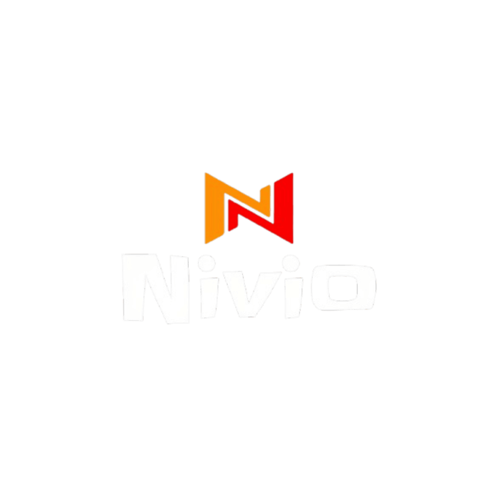

<div align="center">
  

  **A beautiful, all-in-one streaming application for Movies, TV Shows, Anime, and Live IPTV, featuring real-time Watch Parties and offline downloads.**

  [](https://flutter.dev/)
  [](https://firebase.google.com/)
  [](https://supabase.com/)
  [](https://opensource.org/licenses/MIT)

</div>

---

## 📸 Screenshots


<div align="center">
  <table border="0">
    <tr>
      <td align="center"><br><b>Home Screen</b></td>
      <td align="center"><br><b>Media Details</b></td>
      <td align="center"><br><b>Select Provider</b></td>
    </tr>
  </table>
  <table border="0">
    <tr>
      <td align="center"><br><b>Watch Party</b></td>
      <td align="center"><br><b>Live TV</b></td>
      <td align="center"><br><b>Your Library</b></td>
      <td align="center"><br><b>Settings</b></td>
    </tr>
  </table>
  <table border="0">
    <tr>
      <td align="center"><br><b>Video Player</b></td>
    </tr>
  </table>
</div>

---

## 🚀 Features

*   **🎬 Unified Discovery**: Browse trending Movies, TV Shows, and Anime directly from TMDB. Includes dedicated sections for regional content (Tamil, Telugu, Hindi, Korean).
*   **🎌 Dedicated Anime Hub**: Integrated with **AniList** for dedicated Anime scraping from high-speed providers (`Animetsu`, `Animex`, `Miruro`), complete with Miruro Cloudflare bypass and custom quality selection.
*   **🧠 Smart Recommendations**: An intelligent, privacy-first engine that analyzes your local watch history to curate a highly personalized "Top Picks For You" list by interleaving recommendations from your top 5 most recently watched titles.
*   **⚡ Blazing Fast Playback**: Custom native video player (`media_kit`) powered by `libmpv`/MPV for hardware-accelerated decoding, picture-in-picture, and custom controls.
*   **🔊 Loudness Enhancer (Volume Boost)**: Supports software volume boost up to 200% (+20dB gain) via screen swiping or TV arrow keys.
*   **📂 Custom Subtitles & Persistence**: Load subtitle files (.srt, .vtt) locally from your device or paste remote URLs directly. Custom subtitle choices are remembered and auto-mapped for that episode on next play.
*   **📡 Live IPTV**: Stream live television channels using M3U/M3U8 playlists directly from the app.
*   **🎉 Real-Time Watch Parties**: Create a room, share a 6-digit code, and watch movies perfectly synced with your friends. Host playback controls are synchronized across all devices instantly via Supabase.
*   **⬇️ Offline Downloads**: Download your favorite episodes for offline viewing.
*   **🚀 OTA Updates**: Powered by Shorebird, receive instant over-the-air app updates in the background without needing to download a new APK or visit an app store.
*   **💾 Cloud Sync & History**: Sign in with Google or anonymously. Watch progress, history, and watchlists are automatically synced across devices via Firebase Firestore.
*   **🔔 Smart Episode Alerts**: Background push notifications alert you the moment a new episode of your favorite show drops.
*   **🎛️ Total Control**: Change playback speeds, select custom audio tracks, customize subtitle styling, and tweak default video resolutions globally.

---

## 🛠️ Tech Stack

*   **Frontend**: Flutter (Dart `^3.10.0`)
*   **State Management**: Riverpod
*   **Routing**: GoRouter
*   **Backend & Auth**: Firebase (Auth, Firestore)
*   **Realtime Sockets**: Supabase (For Watch Parties)
*   **Local Storage**: Hive & SharedPreferences
*   **Media Playback**: `media_kit` (high-performance playback engine utilizing `libmpv` / MPV for hardware-accelerated rendering and extensive format decoding)

---

## ⚙️ Installation & Setup

### 1. Prerequisites
*   Flutter SDK (`^3.10.0`)
*   A free [Firebase](https://firebase.google.com/) Project
*   A free [TMDB](https://www.themoviedb.org/) API Key
*   *(Optional)* A free [Supabase](https://supabase.com/) Project for Watch Parties

### 2. Clone & Install
```bash
git clone https://github.com/yourusername/nivio.git
cd nivio
flutter pub get
```

### 3. Firebase Setup (Required)
You must connect the app to your own Firebase project for Auth and Database syncing.
1. Create a Firebase project.
2. Enable **Authentication** (Google & Anonymous).
3. Enable **Cloud Firestore**.
4. Use the FlutterFire CLI to configure your app:
   ```bash
   flutterfire configure
   ```
   *(This will generate the required `lib/firebase_options.dart` and native config files).*

### 4. TMDB API Key (Required)
Open `lib/core/constants.dart` and replace the `tmdbApiKey` variable with your own v3 API key:
```dart
const String tmdbApiKey = 'YOUR_TMDB_API_KEY_HERE';
```

### 5. Environment Variables Setup (Optional)
If you want to use the Watch Party feature, custom deep link sharing, or GitHub sponsors, create a `.env` file in the root of the project:
```env
# Supabase Configuration for Watch Parties
SUPABASE_URL=your_supabase_project_url
SUPABASE_ANON_KEY=your_supabase_anon_key

# Deep Link Configuration (URL where redirect.html is hosted)
SHARE_REDIRECT_URL=https://yourusername.github.io/Nivio/redirect.html

# Sponsor Configuration
GITHUB_SPONSOR_URL=https://github.com/sponsors/yourusername
```
*(If you skip this step, the app will still compile and run, but these features will either be disabled or use fallback placeholders).*

### 6. Run the App
```bash
flutter run
```

---

## 📦 Building for Release

To compile a highly-optimized release APK (with R8 minification configured for the video player):

```bash
flutter build apk --release
```

Or run the included bash script to build a Universal APK:
```bash
./build_universal_apk.sh
```

*(Note: Nivio also supports Shorebird for over-the-air (OTA) code pushes without requiring a full app update).*

---

## 🤝 Contributing

Contributions, issues, and feature requests are welcome! 
1. Fork the project.
2. Create your feature branch (`git checkout -b feature/AmazingFeature`).
3. Commit your changes (`git commit -m 'Add some AmazingFeature'`).
4. Push to the branch (`git push origin feature/AmazingFeature`).
5. Open a Pull Request.

Please make sure you run `flutter analyze` before opening a PR to ensure code quality!

---

## ❤️ Acknowledgements

A massive thank you to the creators of [NetMirror-Extension](https://github.com/Sushan64/NetMirror-Extension) for their incredible work. Their repository was a huge inspiration and help in building some of the core scraping and provider logic for this app!

---

## 📜 License

Distributed under the MIT License. See `LICENSE` for more information.

---

## ⚠️ Disclaimer - DMCA

**Nivio does not host any media content.** 
This application acts strictly as an aggregator, scraping metadata and streaming links from publicly available third-party sources on the internet. The developers of Nivio are not affiliated with these sources. You are solely responsible for complying with your local laws, platform terms of service, and digital content rights policies when using this application.
